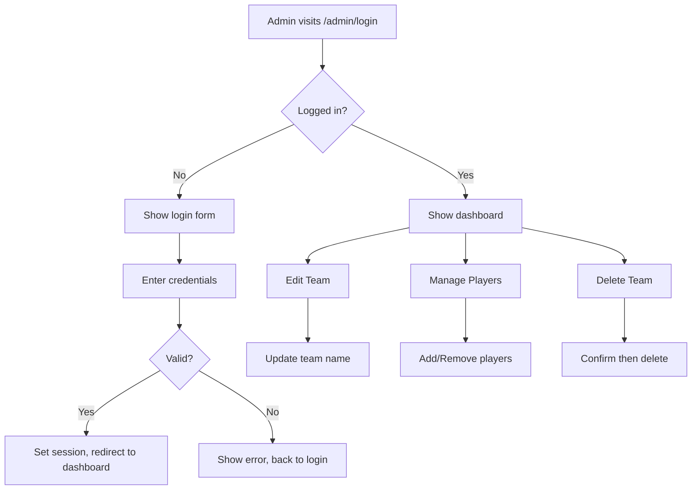

# Admin Login and Team Management Features Plan

## Overview
Implement admin authentication with username/password login to manage teams (edit name, add/remove players, delete teams).

## Architecture

### Database Changes
Add `Admin` model to `src/database/__init__.py`:

```python
class Admin(db.Model):
    """Admin user for managing the application."""
    __tablename__ = 'admins'
    
    id = db.Column(db.Integer, primary_key=True)
    username = db.Column(db.String(50), unique=True, nullable=False)
    password_hash = db.Column(db.String(128), nullable=False)
    created_at = db.Column(db.DateTime, default=db.func.current_timestamp())
```

### New Routes

| Route | Method | Description |
|-------|--------|-------------|
| `/admin/login` | GET/POST | Admin login page |
| `/admin/logout` | GET | Logout and clear session |
| `/admin/dashboard` | GET | Admin dashboard with all teams |
| `/admin/team/<int:team_id>/edit` | GET/POST | Edit team name |
| `/admin/team/<int:team_id>/players` | GET/POST | Add/remove players |
| `/admin/team/<int:team_id>/delete` | POST | Delete team with confirmation |

### Template Files

1. `templates/admin_login.html` - Login form
2. `templates/admin_dashboard.html` - List all teams with actions
3. `templates/admin_edit_team.html` - Edit team name form
4. `templates/admin_manage_players.html` - Add/remove players interface

### Workflow



## Implementation Steps

### Step 1: Database Model
- Add Admin model with username and password_hash columns
- Add helper methods for password hashing/verification

### Step 2: Authentication Routes
- Create login route with form validation
- Create logout route to clear session
- Create decorator to protect admin routes

### Step 3: Admin Dashboard
- List all teams with player counts
- Add action buttons (Edit, Manage Players, Delete)

### Step 4: Team Management
- Edit team name functionality
- Add player to team (search existing or create new)
- Remove player from team
- Delete team with confirmation

### Step 5: UI Updates
- Add admin link to navigation bar (visible when logged in)
- Style admin pages to match existing design
- Add flash messages for success/error feedback

## Security Considerations

1. **Password hashing**: Use Werkzeug's `generate_password_hash` and `check_password_hash`
2. **Session management**: Use Flask's secure session with long expiration
3. **Route protection**: Create `@admin_required` decorator for all admin routes
4. **CSRF protection**: Use Flask-WTF or manual CSRF tokens for forms

## Files to Create/Modify

### New Files:
- `league_tracker/templates/admin_login.html`
- `league_tracker/templates/admin_dashboard.html`
- `league_tracker/templates/admin_edit_team.html`
- `league_tracker/templates/admin_manage_players.html`

### Modified Files:
- `league_tracker/src/database/__init__.py` - Add Admin model
- `league_tracker/app.py` - Add admin routes and login logic
- `league_tracker/templates/base.html` - Add admin nav link

## Initial Admin Setup

On first run, create a default admin account:
- Username: `admin`
- Password: `admin123` (should be changed on first login)

Or provide a setup command to create the initial admin.
