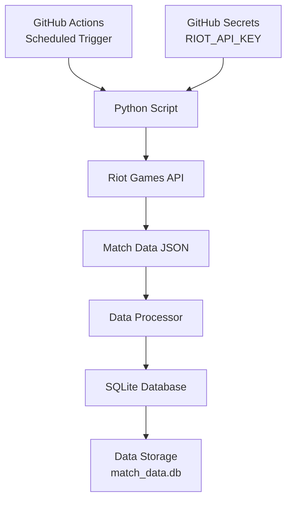

# Riot API Data Collection Project Plan

## Project Overview
A Python-based automated system that connects to the Riot Games API to collect League of Legends match data, stores it in SQLite, and runs automatically via GitHub Actions on a daily schedule.

## Requirements Summary
- **Game**: League of Legends
- **Data**: Match outcomes and player stats
- **Frequency**: Daily updates
- **API Key**: User already has one
- **Purpose**: Personal analysis

---

## System Architecture



---

## Database Schema Design

### Tables

#### 1. `summoners` - Track monitored players
| Column | Type | Description |
|--------|------|-------------|
| id | INTEGER PRIMARY KEY | Auto-increment ID |
| puuid | TEXT UNIQUE | Riot's unique player identifier |
| game_name | TEXT | Player's in-game name |
| tag_line | TEXT | Player's tag (e.g., #NA1) |
| region | TEXT | Server region (na1, euw1, etc.) |
| last_match_timestamp | INTEGER | Last processed match timestamp |
| created_at | TIMESTAMP | When added to database |

#### 2. `matches` - Match metadata
| Column | Type | Description |
|--------|------|-------------|
| id | INTEGER PRIMARY KEY | Auto-increment ID |
| match_id | TEXT UNIQUE | Riot's match identifier |
| game_duration | INTEGER | Match duration in seconds |
| game_version | TEXT | Patch version |
| queue_id | INTEGER | Game mode queue type |
| game_creation | INTEGER | Match start timestamp |
| platform_id | TEXT | Server region |

#### 3. `match_participants` - Individual player stats per match
| Column | Type | Description |
|--------|------|-------------|
| id | INTEGER PRIMARY KEY | Auto-increment ID |
| match_id | TEXT FK | Reference to matches table |
| puuid | TEXT | Player's unique identifier |
| champion_id | INTEGER | Champion played |
| champion_name | TEXT | Champion name |
| team_id | INTEGER | 100 (blue) or 200 (red) |
| win | BOOLEAN | Win/loss result |
| kills | INTEGER | Kills |
| deaths | INTEGER | Deaths |
| assists | INTEGER | Assists |
| kda | REAL | Kill/Death/Assist ratio |
| total_damage_dealt | INTEGER | Total damage to champions |
| gold_earned | INTEGER | Gold earned |
| cs | INTEGER | Creep score (minions + monsters) |
| vision_score | INTEGER | Vision score |
| summoner_spell_1 | INTEGER | First summoner spell |
| summoner_spell_2 | INTEGER | Second summoner spell |
| primary_rune | INTEGER | Primary keystone rune |
| secondary_rune | INTEGER | Secondary rune tree |
| item_0 through item_6 | INTEGER | Item slots |

---

## File Structure

```
riot_api_project/
├── .github/
│   └── workflows/
│       └── daily_data_collection.yml    # GitHub Actions workflow
├── src/
│   ├── __init__.py
│   ├── config.py                        # Configuration & constants
│   ├── database.py                      # SQLite operations
│   ├── riot_api.py                      # Riot API client
│   ├── data_processor.py                # Data transformation
│   └── main.py                          # Entry point
├── data/
│   └── .gitkeep                         # Database stored here (gitignored)
├── tests/
│   └── test_placeholder.py
├── requirements.txt                     # Python dependencies
├── .gitignore
└── README.md
```

---

## Implementation Plan

### Phase 1: Core Python Application
1. **Configuration Module** ([`config.py`](src/config.py))
   - Load API key from environment variables
   - Define region mappings and constants
   - Set rate limiting parameters

2. **Riot API Client** ([`riot_api.py`](src/riot_api.py))
   - Implement rate-limited HTTP requests
   - Methods for:
     - Get PUUID from summoner name
     - Get match history for a player
     - Get detailed match data
   - Error handling and retry logic

3. **Database Module** ([`database.py`](src/database.py))
   - Initialize SQLite database with schema
   - CRUD operations for all tables
   - Connection management

4. **Data Processor** ([`data_processor.py`](src/data_processor.py))
   - Transform API JSON into database records
   - Calculate derived metrics (KDA, etc.)
   - Handle data validation

5. **Main Entry Point** ([`main.py`](src/main.py))
   - Orchestrate the data collection flow
   - Load summoners to monitor
   - Fetch new matches
   - Store data in database

### Phase 2: GitHub Actions Integration
1. **Workflow File** ([`.github/workflows/daily_data_collection.yml`](.github/workflows/daily_data_collection.yml))
   - Schedule trigger (daily at specified time)
   - Environment setup (Python 3.11+)
   - Secret management for API key
   - Artifact upload for database backup

### Phase 3: Configuration & Documentation
1. **Requirements** ([`requirements.txt`](requirements.txt))
   - `requests` for HTTP calls
   - Standard library for SQLite

2. **Git Ignore** ([`.gitignore`](.gitignore))
   - Exclude database files
   - Exclude Python cache
   - Exclude environment files

3. **README** ([`README.md`](README.md))
   - Setup instructions
   - API key configuration
   - Usage guide

---

## GitHub Actions Workflow

```yaml
# .github/workflows/daily_data_collection.yml
name: Daily Riot Data Collection

on:
  schedule:
    - cron: '0 6 * * *'  # Daily at 6 AM UTC
  workflow_dispatch:      # Manual trigger option

jobs:
  collect-data:
    runs-on: ubuntu-latest
    steps:
      - uses: actions/checkout@v4
      - uses: actions/setup-python@v5
        with:
          python-version: '3.11'
      - run: pip install -r requirements.txt
      - run: python src/main.py
        env:
          RIOT_API_KEY: ${{ secrets.RIOT_API_KEY }}
      - uses: actions/upload-artifact@v4
        with:
          name: match-database
          path: data/match_data.db
```

---

## Security Considerations

1. **API Key Storage**: Store in GitHub Secrets (`RIOT_API_KEY`)
2. **Database**: Not committed to repo (use artifacts for persistence)
3. **Rate Limiting**: Respect Riot API rate limits (20 requests/sec for development keys)
4. **No Hardcoded Credentials**: All sensitive data via environment variables

---

## Rate Limiting Strategy

Riot API Development Keys: 20 requests/second, 100 requests/2 minutes

Implementation:
- Use `time.sleep()` between requests
- Implement exponential backoff on 429 responses
- Queue system for batch processing

---

## Next Steps

Once you approve this plan, I will:
1. Switch to Code mode
2. Implement all Python modules
3. Create the GitHub Actions workflow
4. Set up the project structure
5. Provide instructions for GitHub Secrets configuration

Does this plan meet your requirements? Would you like any modifications to the data collected, the schedule, or the database schema?
